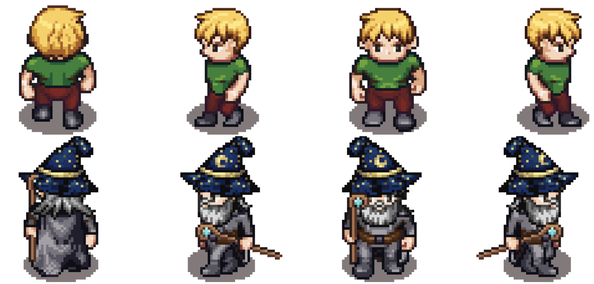
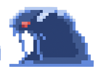
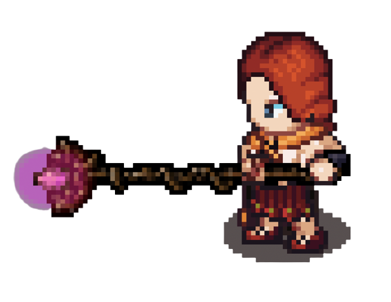
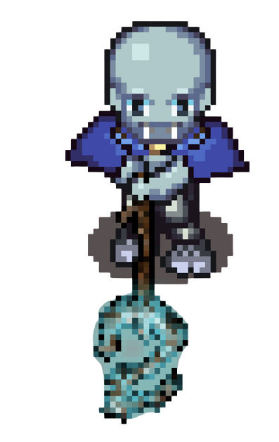
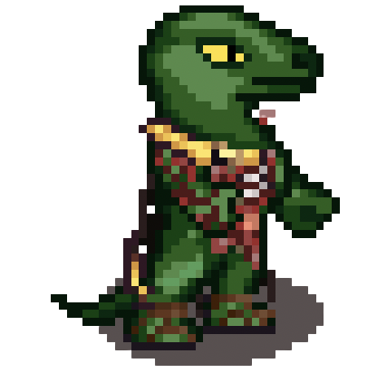
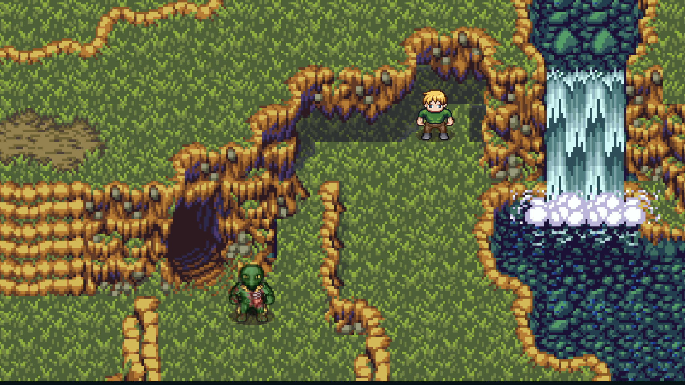
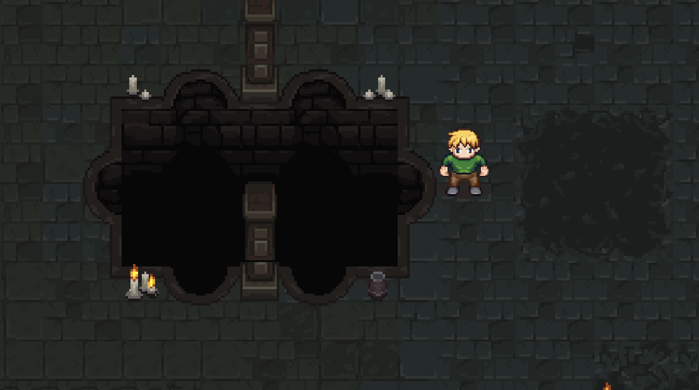
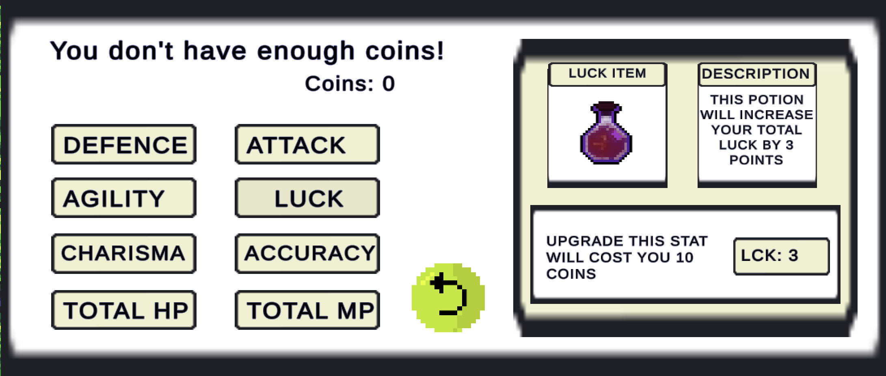

# **The Zazacrifice of Shaggy**
    Game by: 
    Franciso Martinez A01782250
    Santiago Tena A01781283
    Sergio Zuckermann A01024831
    Domingo Mora A01783317
    Ian Holender A01026295
    Rafa Blanga A01781442

## _Game Design Document_

---

##### **Copyright notice / author information / boring legal stuff nobody likes**

##
## _Index_

---

1. [Index](#index)
2. [Game Design](#game-design)
    1. [Summary](#summary)
    2. [Gameplay](#gameplay)
    3. [Mindset](#mindset)
3. [Technical](#technical)
    1. [Screens](#screens)
    2. [Controls](#controls)
    3. [Mechanics](#mechanics)
4. [Level Design](#level-design)
    1. [Themes](#themes)
    2. [Game Flow](#game-flow)
5. [Development](#development)
    1. [Abstract Classes](#abstract-classes--components)
    2. [Derived Classes](#derived-classes--component-compositions)
6. [Graphics](#graphics)
    1. [Style Attributes](#style-attributes)
    2. [Graphics Needed](#graphics-needed)
7. [Sounds/Music](#soundsmusic)
    1. [Style Attributes](#style-attributes-1)
    2. [Sounds Needed](#sounds-needed)
    3. [Music Needed](#music-needed)
8. [Schedule](#schedule)

## _Game Design_

---

### **Summary**

Dive into an exciting adventure with The Zazacrifice of Shaggy, a turn-based RPG that follows the protagonist, Shaggy, as he battles his way through. Encounter fierce enemies and explore amazing sceneries through this challenging and immersive RPG. 

### **Gameplay**

As Shaggy attempts to rescue his furry companion, Scooby, who was abducted by a mysterious gang. A homeless man who witnessed the abduction gives Shaggy information about the gang’s whereabouts in exchange for the recovery of some heavily sedating potions that the gang stole from him.

Arm yourself with a selection of weapons to prepare yourself for the battles ahead. The homeless man offers Shaggy three types of weapons; these will determine the set of attacks and statistics available throughout the game. Shaggy must be prepared for the enemies he will encounter on his journey.  There will be semi-bosses protecting an elemental chest and a NPC storyteller, after deafiting the Semi-boss Shaggy will unlock a new element and the NPC Storyteller will tell Shaggy a fragment of scooby´s mistery. He also begins with a selection of items with basic uses, including Rage, Health Boost, Endurance Boost, and Special Powers. As he progresses, he may find other potions, spells and abilities to help him along the way.

The gameplay of The Zazacrifice of Shaggy is designed to be an adventurous game with PvP battles against NPCs and level bosses. Search for hidden secrets as you battle your way through intense boss battles and difficult dungeons. Unlock new abilities, customize your character with a variety of weapons,armor  and elements to unlock the door to the tower and make your way to the top of the tower and uncover the truth behind the Zazacrifice. An unforgettable journey awaits in The Zazacrifice of Shaggy

### **Mindset**

The ideal mindset we strive for in this game is the following: We want the user to feel a sense of wonder at the start of the game as he is being told the story of the game. When the user has chosen his battle abilities and has a bit more of context as well as power, we want the player to feel powerful and excited for this new adventure. To provoke the player even more we plan on adding NPC’s whose purpose is to slow the player down (MOB´s), so the salvation of his furry companion doesn't come that easy. This will provoke the player to prepare and strategically play his way into the castle. A feeling of urge and hurry for saving scooby will also be provoked, by the dialogs of the NPCs and shaggy's flashbacks.

## _Technical_

---
### **Screens**

1. Title Screen
    1. Menu
    2. options 
2. Game
    1. Inventory adn Ganalf's store
    2. Map
    3. Playable
3. End Credits

### **Controls**

we will have 2 different gaming options:

Option A (gamer type):
controls:
1. "W" = forward
2. "D" = right.
3. "S" = backwards
4. "A" = Left.
5. "I" = Inventory/Store.
6. "Left mouse click" = select.

Option B (Modern type):
controls:
1. "Up arrow" = forward.
2. "Right arrow" = right.
3. "Down arrow" = backwards
4. "Left Arrow" = Left.
5. "I" = Inventory/Store.
6. "Left mouse click" = select.

### **Mechanics**
_Combat System_:

 The main mechanic of the game will be the combat system, this system will be based on the following stats:
 
    1. -HP (Health Points)
    2. -MP (Man points to use elemnts)
    3. -STR (How strong the attacks will be)
    4. -DEF (How much will resist enemy attacks)
    5. -LUC (Increases probability of making a critical attack)
    6. -AGL (Decreases probability of getting a critical attack)
    7. -CHR (Charisma will allow you to get better rewards)
    8.-ACC (Accuracy is a character's ability to hit an enemy. This can be used to increase the chance of hitting an enemy)

The combat will have the following rules and characteristics:
- The goal of the combat is to defeat every enemy by getting their HP stat all the way to zero.

- On a combat you´ll be fighting 1 enemy. 

- The combat will be turned base until the main character or the enemies no longer has HP.

- During combat the player can choose to use normal attacks, element attacks (consumes MP, but are stronger and have special abilities), heal or recharge mana, change element or run away from the battle.

- The character will have one of three classes (light, medium, heavy), that will affect their statistics. The chosen class at the begging sets the characters stats and this can be upgraded in the Gandalf's Store.

- There is a chance to receive or deal a critical attack .The luck stat will increase your chances of dealing this kind of attacks (remember if enemies have a very high Luck Stat they can deal the critical attack).

- Character will have an element when the combat starts. This elements are the following:
    1. Fire 
    2. Thunder
    3. Ice

- The damage an attack does will be calculated, taking into consideration the following: 
    - The attack stat from the attacker.
    - The defense stat from the receiver.
    - The attack power.
    - If the attack is critical.
    - If the characters have element weaknesses or strenghs.

- If the match is won the player is rewarded with coins. The amount depends on the defeated enemy.

- Bosses and Semi-Bosses will have fixed stats, this to make them hard battles for the player.

_Movements, Exploration and Objectives_:

The game will be a topdown RPG, where the player will be able to move freely on the designated zone of the map. The movements and exploration mechanics will have the following rules and characteristics:

- The player will be able to interact with the enemies.

- The Tower will be closed for the player until the necessary tasks to advance are completed. The player needs the three elements in order to get there.

- If enemies notice main character they´ll run after after him (excluding the semibosses and fina boss).

- Text Dialogs and story events will be displayed, if certain conditions are satisfied.

- In the overworld the player can see their current health and mana points in the inventory.

- The main objective is to save Scooby by defeating all the semi-bosses in order to acquire the different elements to be able to defeat the final boss.

_Other_ : 

- The inventory can be accesed with the "I" key. Here you can check, recharge and upgrade your stats.

_Possible results of the game_:

- The player saves Scooby by defeating the final boss. 

- The player respawns in the last saved checkpoint.

## _Level Design_

### **Themes**

1. Forest
    1. Mood
        1. Green, Mysterious, adventurous
  2. Objects
        1. _Ambient_
            1. Bush
            2. Tree
            3. Tree trunk
            4. Rock
            5. Gate
            6. Grass
            7. River
            8. Waterfall

        2. _Interactive_
            1. Chests
            2. Berries
            3. Apples
            4. Enemy DaBull
            5. Ice Lord
            6. Thunder Lord
            7. Fire Lord
            8. Throrondor the King of the Eagles

5. Tower
    1. Mood
        1. Dangerous, tense, Creepy and Ominous
    2. Objects
        1. _Ambient_
            1. ObstacleCastleRock
            16. ObstacleCastlePillar
            17. Torches
            19. Locked doors
            20. Catle Ground
    
    2. _Interactive_
        1. Enemy slime
        2. King DaBull
        3. Final boss AMLO

### **Game Flow**
1. Player selects between light, medium and heavy.

2. Introduction cutscene.

3. Player starts at forest.

4. Shaggy explores forest, having encounters with NPC's (Thorondor) as well as having chances. The Eagle tells Shaggy he needs the three elements.

5. Shaggy finds and fights DaBull, the first enemy in the forest.

6. Shaggy finds and fights semi-bosses protecting the forest; elements are earned in victory.

7. The Storyteller NPC with each semi-boss will give the user more context of what happended with scooby as of who he will encounter further on so 'Shaggy' can plan accordingly (Sneak-peak of bosses).

8. Once "Shaggy" has collected all elements he'll be able to move to the Tower.

9. Once in the slime infected tower Shaggy must make his way to defeat the fianl boss.

10. Final and credits cutscene.

## _Development_

---

### **Abstract Classes / Components**

1. BasePhysics
    1. BasePlayer
    2. BaseEnemy
    3. BaseNPC
2. BaseObstacle
3. BaseInteractable

### **Derived Classes / Component Compositions**

#### *Program scripts required 

1. BasePlayer *(PlayerMovement, PlayerAttacks, PlayerInteractions, PlayerClass, PlayerObjectConsumable, PlayerUptdateStats)
    1. PlayerMain
        1. Light player 
        2. Middle player 
        3. Heavy player 

2. BaseEnemy *(EnemyMovement, EnemyAttack, EnemyInteractions, EnemyClass)
    1. EnemySlime (Tower)
    2. EnemyDaBull (Forest)
    3. EnemyFireLord (semi-boss, drops fire element, Forest)
    4. EnemyIceLord (semi-boss, drops ice element, Forest)
    5. EnemyThunderLord (semi-boss, drops thunder element, Forest)
    6. EnemyAMLO (final boss, Tower)

3. BaseNPC *(NpcInteractions)
    1. Thorondor (King of Eagles)

4. BaseObject *(PLayerObjectInteraction, ObjectEffects)

    1. Elements
        1. Fire (makes 2 dameges for 3 turns, enemy/player)
        2. Thunder (Doubles stats, enemy/player)
        3. Ice (Freezes, enemy/player)

    2. Others
        1. Coins

4. BaseObstacle 

    1. Wall
    2. Bush
    3. Tree
    4. Tree trunk
    5. Rock
    6. Grass
    7. ObstacleCastleRock
    8. ObstacleCastlePillar
    9. Torches
    10. Paths

5. BaseInteractable *(PlayerItemInteraction)
    1. InteractableButton

*(SceneLoading)      

_(example)_

## _Graphics_

### **Style Attributes**

Every area will have a different palette to show the difference between the feelings that the area is trying to convey. At the tower the colors will be dark purples, grays and blacks while the forest will be bathed in natural greens, lush blues and a more colorful feeling. Right now there is not a plan to make a limited palette because the world might suffer from those limitations especially in the short amount of development time. So because of time constraints and for not choosing a limited palette a HSV map is out of the question, if an element feels out of order the colors will be altered to maintain consistency without HSV maps. Anyways, because consistency is key for immersion, the aim will be to make every element part of the world with their colors even though we're not using a color palette, but more of a color vibe.

The graphic style of the game is going to be based on 16 bit-s JRPG’s so the look will be pixely with a medieval twist because of the RPG genre making for a very interesting combination of D&D, Scooby Doo and 16 bit-games. Everything is going to be pixely, outlining important characters and elements of the game with a wider border. We will be emphasizing on the sharp squared feel of the 16 bit genre, which pulled off the sharper edges over circular graphics flawlessly. The most important elements will be enemies, NPCs, Shaggy, enemies and interactables. Also, the assets will be recovered from limited free sources so that the style doesn’t vary a lot. The supervisor of the visual style of the game will have the job to approve every single element of the game so that it can achieve a cohesive style.

Every single intractable object in the game will have a prompt so that the player notices the enemy or NPCs and interacts with it. When delivering a critical hit the enemy will announce a critical hit with bolder text. The melee attacks will feel faster and the element attacks will have particle effects. Every element will have its own distinct color so that the player has no problem recognizing between them. 

### **Graphics Needed**

(Animations)= (Idle, Walk, Attack, Consuming)

1. GraphicsPlayer
    1. PlayerMain (Animations)

2. GraphicsEnemy
    1. EnemySlime (Animations)
    2. EnemyDaBull (Animations)
    3. EnemyFireLord (Animations)
    4. EnemyIceLord (Animations)
    5. EnemyThunderLord (Animations)
    6. EnemyAMLO (Animations)

4. GraphicsNPC
    1. NPCEagle (Idle)
    2. NPCGandalf (Idle)

3. GraphicsObject

    1. GraphicsWeapons

        1. Dagger (Item Grpahic, Attack animation)
        2. Mallet (Item Grpahic, Attack animation)
        3. Fire Staff (Item Grpahic, Attack animation)
        4. Ice Staff (Item Grpahic, Attack animation)
        5. Wood Staff (Item Grpahic, Attack animation)
        6. Wood Bat (Item Grpahic, Attack animation)

    3. GraphicsOthers
        1. Elements 
            1. Fire element (icon)
            2. Ice element (icon)
            3. Thunder element (icon)
        4.  Stat Potions 
            1. AttackPotion (icon)
            2. DefensePotion (icon)
            3. LuckPotion (icon)
            4. CharismaPotion (icon)
            5. AccuracyPotion (icon)
            6. ManaPotion (icon)
            7. StenghtLuckPotion (icon)
            8. AgilityLuckPotion (icon)

4. VisualsObstacle 

    2. Wall
    9. Bush
    10. Tree
    11. Tree trunk
    12. Rock
    13. Gate
    14. Grass
    15. ObstacleCastleRock
    16. ObstacleCastlePillar
    17. Torches
    22. Paths

_Examples:_

### Main Menu:

### Main Character and NPC:

### Slime Sprite:

### Fire Lord Sprite:

### Ice Lord Sprite:

### Thunder Lord Sprite:

### World Assets:

### Dungeon Assets:

### Invetory:

## _Sounds/Music_

---

### **Style Attributes**

We are aiming to have a cohesive game expierence across the game, and of course the music and sound efects are no exception. We want the music to inspire mystery and a sense of adventure to get the player into the same type of mood we were in while creating this game. 

Across the game the player will be experiencing music heavily carried by synthesizers in order to get this mystical feeling we have been talking about. The songs will be changing depending on what the player is doing, for example there will be one specific song as our main theme that the player will be able to hear while in the menu called _Gandalf pack_ by the artist _xac_. On the other hand, playable sceneries will have different soundtracks like the fores, Gandalf&#39;s store, the tower, and everytime you fight an enemy. 

Regarding the sound effects, these will be reactive to the player&#39;s actions, like the sound of the steps depending on the surface, or wether the player is opening a chest or a door. All of these sound effects will be in a 8 or a 16 bit style.

### **Sounds Needed**

1. Effects

    1. "pip" (button sound)

### **Music Needed**

1. Zelda Lost Woods
2. Synthwave, reverbed, slow-paced track. Gandalf Pack by Xac
3. Creepy, slow &quot;dungeon&quot; track
4. Sad ending credits track
5. Fast-paced, accelerated-paced, mob, semiboss and final boss track. Let the Battles Begin (Final Fantasy V)

_(example: https://youtu.be/ZxRHXC2SB4E Gandalf Pack by Xac)_

## _Schedule_

---

1. Develop base classes and combat system (March 17- March 25)
    1. base player
    2. base enemy
    3. base stats
    4. base elements
    5. base items
    6. base attacks
    7. base classes

2. Recover all visuals/sounds used in the game (March 17- March 25)
	1. All Shaggy’s sprites
	2. All NPCs sprites
	3. All enemies and boss sprites
	4. All menu/narrative/base game sprites
	5. All Obstacle sprites
	6. All item and gear sprites
	7. All the game soundtrack
	8. All the game sound effects
	9. The different scenes world maps

3. Implement obstacles, game map, character and intractable properties  (March 26- April 5)
	1. Implement controls
	2. Implement sprites
	3. Implement game sounds
	4. Implement collision properties for obstacles
	5. Implement intractable properties for interactables
	6. Implement menu
	7. Implement backpack

4. Implement combat (April 5- April 8)
	1. Testing combat and difficulty feel
	2. Balancing the game

5. Bug fixes and polishing (April 8- April 12)
