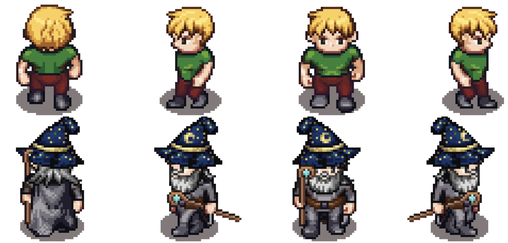
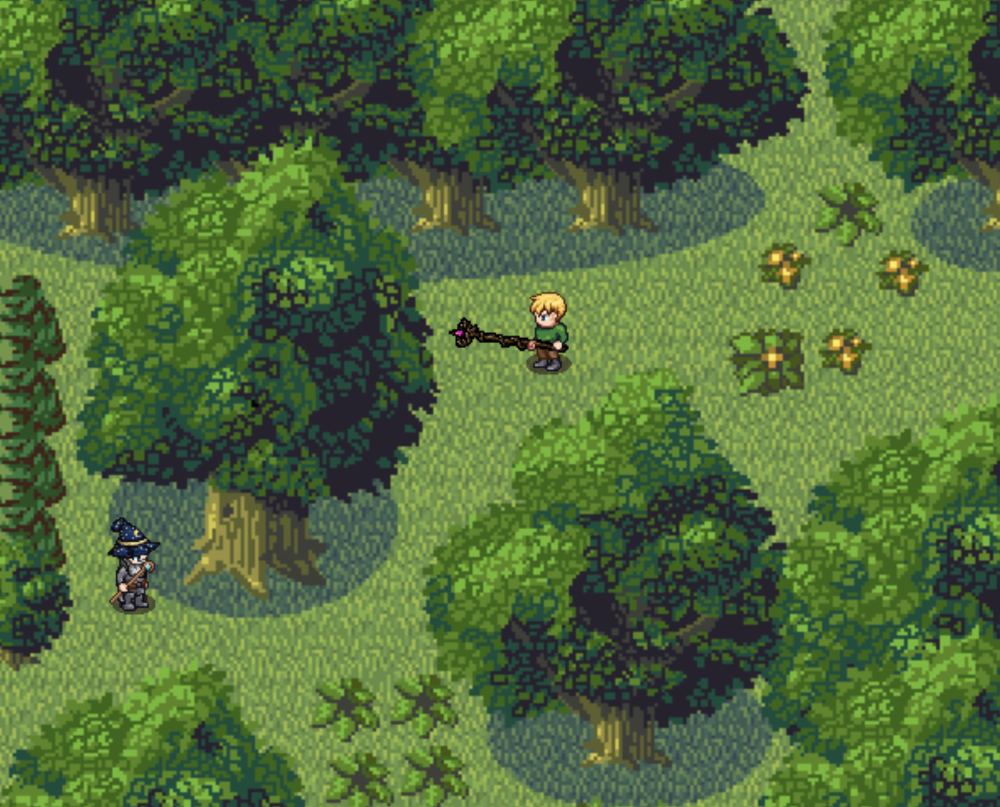
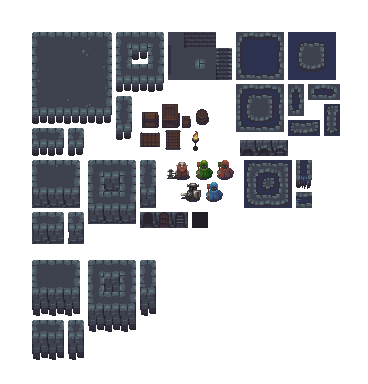
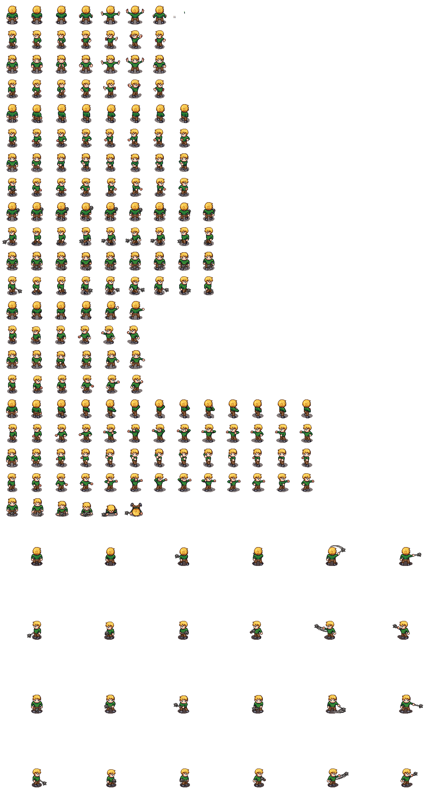

# **The Zazacrifice of Shaggy**

## _Game Design Document_

---

##### **Copyright notice / author information / boring legal stuff nobody likes**

##
## _Index_

---

1. [Index](#index)
2. [Game Design](#game-design)
    1. [Summary](#summary)
    2. [Gameplay](#gameplay)
    3. [Mindset](#mindset)
3. [Technical](#technical)
    1. [Screens](#screens)
    2. [Controls](#controls)
    3. [Mechanics](#mechanics)
4. [Level Design](#level-design)
    1. [Themes](#themes)
        1. Ambience
        2. Objects
            1. Ambient
            2. Interactive
        3. Challenges
    2. [Game Flow](#game-flow)
5. [Development](#development)
    1. [Abstract Classes](#abstract-classes--components)
    2. [Derived Classes](#derived-classes--component-compositions)
6. [Graphics](#graphics)
    1. [Style Attributes](#style-attributes)
    2. [Graphics Needed](#graphics-needed)
7. [Sounds/Music](#soundsmusic)
    1. [Style Attributes](#style-attributes-1)
    2. [Sounds Needed](#sounds-needed)
    3. [Music Needed](#music-needed)
8. [Schedule](#schedule)

## _Game Design_

---

### **Summary**

Dive into an exciting adventure with The Zazacrifice of Shaggy, a turn-based RPG follows the protagonist, Shaggy, as he battles his way through a mysterious tower. Encounter fierce enemies, navigate tricky puzzles and uncover hidden secrets as you journey through this challenging and immersive RPG. 

### **Gameplay**

Shaggy, as he attempts to rescue his furry companion, Scooby, who was abducted by a mysterious gang. A homeless man who witnessed the abduction gives Shaggy information about the gang’s whereabouts in exchange for the recovery of some heavily sedating potions that the gang stole from him.

Arm yourself with a selection of weapons to prepare yourself for the battles ahead. The homeless man offers Shaggy three types of weapons; these will determine the set of attacks and statistics available throughout the game. Shaggy must be prepared for the enemies he will encounter on his journey.  There will be semi-bosses protecting an elemental chest and a NPC storyteller, after deafiting the Semi-boss Shaggy will unlock a new element and the NPC Storyteller will tell Shaggy a fragment of scooby´s mistery. He also begins with a selection of items with basic uses, including Rage, Health Boost, Endurance Boost, and Special Powers. As he progresses, he may find other potions, spells and abilities to help him along the way.

The gameplay of The Zazacrifice of Shaggy is designed to be an adventurous game with PvP battles against NPCs and level bosses. Search for hidden secrets as you battle your way through intense boss battles and difficult dungeons. Unlock new abilities, customize your character with a variety of weapons,armor  and elements as you make your way to the top of the tower and uncover the truth behind the Zazacrifice. An unforgettable journey awaits in The Zazacrifice of Shaggy

### **Mindset**

The ideal mindset we strive for in this game is the following: We want the user to feel a sense of wonder at the start of the game as he is being told the story of the game. When the user has chosen his battle abilities and has a bit more of context as well as power, we want the player to feel powerful and excited for this new adventure. To provoke the player even more we plan on adding NPC’s whose purpose is to slow the player down (MOB´s), so the salvation of his furry companion doesn't come that easy. This will provoke the player to prepare and strategically play his way into the castle. 

## _Technical_

---
### **Screens**

1. Title Screen
    1. Menu
    2. options 
2. Level Select
3. Game
    1. Inventory
    2. Map
    3. Gandalf´s store 
4. End Credits

_(example)_

### **Controls**

we will have 2 different gaming options:

Option A (gamer type):
controls:
1. "W" = forward
2. "D" = right.
3. "S" = backwards
4. "A" = Left.
5. "Q" = Interact (open doors, confirm purchases, drink potions)
6. "I" = Inventory/Bag
7. "ESC" = Menu.

Option B (Modern type):
controls:
1. "Up arrow" = forward
2. "Right arrow" = right.
3. "Down arrow" = backwards
4. "Left Arrow" = Left.
5. "Q" = Interact (open doors, confirm purchases, drink potions)
6. "I" = Inventory/Bag
7. "ESC" = Menu.

### **Mechanics**
_Combat System_:

 The main mechanic of the game will be the combat system, this system will be based on the following stats:
 
1. -HP (Life Points)
2. -MP (Magic points to use special attacks)
3. -STR (How strong the attacks will be)
4. -DEF (How much will resist enemy attacks)
5. -LUC (Increases probability of making a critical attack)
6. -CHR (It will allow you to get discounts in the store and better rewards but enemies have a chance of calling a new mob)

The combat will have the following rules and characteristics:
- On a combat you´ll be able to fight between 1 and 5 enemies. 
.
- The combat will be in turned base until the main character or the enemies no longer has HP.

- During combat the player can choose to use normal attacks, magic attacks (consumes MP, but are stronger and have special abilities), use a consumable(Item that will afect stats), change element or run away from the battle.

- The equipped weapon will affect the characters stats.

- There is a chance to receive or deal a critical attack that does 200% damage.The luck stat will increase you´re chances of dealing this kind of attacks (remember if enemies have a very high Luck Stat they can deal the critical attack).

- The character will have one of three classes (light, medium, heavy), that will affect their statistics.

- Character will have an element when the combat starts. This elements are the following:

1. Fire 
2. Electric 
3. Ground 
4. Water 
5. Wind

- Elements will have advantage against another element as the following:
1. Fire > Wind 
2. Water > Fire
3. Electric > Water 
4. Ground > Electric
5. Wind> Ground

- If the an character attacks a character where it's element has an advantage over the other the attack will deal 2x, and if the element has a disadvantage it will deal 0.5x.

- So the damage an attack does will be calculated, taking into consideration the following: 
    - The attack stat from the attacker.
    - The defense stat from the receiver.
    - The attack power.
    - If the attack is critical.
    - If the characters have element weaknesses or strenghs.

- The first attack will be decided by who attacks first the other on the map.

- If the match is won the player is rewarded with money.

- The enemies stats will be determined by the total sum of shaggy's stats. The total sum will be multipled by a number which is unique to each enemy and then will be distributed equally between the enemy's stats. for example: The weakest enemies will have a very low multiplier aproximately of .30, so 30% of Shaggy total sum of stats will be distributed in the foes stats. Next the 25% of Shaggy's total sum will be given to a random stat of the enemy for example: An enemy will get a boost in atack or resistance. This is to make the combat dynamic and non glued to EXP conventions, the boost will be shown in a text For example "Wow, this wizard has a lot of strenght +25 STR".

- Bosses and Semi-Bosses will have fixed stats, this to make them hard battles for the player.

_Movements and Exploration_:

The game will be a topdown RPG, where the player will be able to 
explore to move freely on the designated zone of the map. The movements and exploration mechanics will have the following rules and characteristics:

- The player will be able to interact with objects, characters and enemies.

- Some objects such as coins will grant the player benefits when picking them up.

- Zones in the map will be closed for the player until the necessary tasks to advance are completed.

- The player will also get consumables to regenerate HP and MP or key items by completing battles or side-quests.

- If enemies notice main character they´ll run forward after him, in case of colappsing (with main character) the battle will begin with enemies having the first attack.

- If main character hits enemy, the battle will begin with main character having the first attack

- Text Dialogs and story events will be displayed, if certain conditions are satisfied.

- In the overworld the player can see their current health and magic points in the down left corner.

_Other_:

- The pause screen will show resume, quit and backpack. The backpack is the main hub of the game, a menu, showing the screen in four quarters the first one  (upper left) will show three option which will be shown in the second quarter (upper right). SThe options are ITEM, GEAR and MOVES, the player's possesions in will be shown in the second quarter depending on which category they are. The third quarte will show haggy's current stats (down left). The fourth one (down right) will show the current selection in the second quarter with an image and description of the selection. 

- Gandalf stores will be distributed on the map, each store will have unique items that the player can buy.

## _Level Design_

### **Themes**

1. Village
    1. Mood
        1. Calm, friendly, cozy, nice
    2. Objects
        1. _Ambient_
            1. Houses
            2. Paths
            4. wooden fences
            
        2. _Interactive_
            1. Villager NPC
            2. Doors

2. Forest
    1. Mood
        1. Green, Mysterious, adventurous
  2. Objects
        1. _Ambient_
            1. Trees
            2. Bushes
            3. Tall grass
            4. Rocks
            5. River
            6. Bridge

        2. _Interactive_
            1. Chests
            2. Berries
            3. Apples
            4. Enemy Zabush
            5. Enemy Wizzard
            7. EnemyZaclon
            8. Golden Coins
            9. EnemyGiantZanaZana (semi-boss, each semi-boss)

2. Castle
    1. Mood
        1. Dangerous, tense, Creepy.
    2. Objects
        1. _Ambient_
            1. 
            2. Torches
            3. Suits of armor
        2. _Interactive_
            1. Chest
            3. Doors
            4. EnemyZaguards
            5. EnemyZaclon
            6. EnemyLordZAggy
            7. Golden Coins

### **Game Flow**
1. Player starts in Village.

2. NPC calls shaggy and gives him his first task (Here the user selects class and first element).

3. Game tells you to go to the forest.

4. Shaggy leaves village. 

5. Shaggy enters the forest.

6. Shaggy explores forest, having encounters with NPC's as well as having chances of collecting consumables to help the user later on.

7. Shaggy experiences an event where he experiences a flashback of that night. Also he is tasked to go find elements.

8. Shaggy finds semi-bosses protecting the forest; elemental chest are earned in victory, recieving new elements as well as a fragment of what happened with scooby.

9. The Storyteller NPC with each semi-boss will give the user more context of what happended with scooby as of who he will encounter further on so 'Shaggy' can plan accordingly (Sneak-peak of bosses).

10. Once "Shaggy" has collected all elements he experiences an event were he will now know where to go next (Exit the Forest).

11. Shaggy must find the castle location, which can be found beyond the forest.

12. Shaggy finds a Story-telling NPC in the outskirts of the castle where he must use & try-out new elements by completing mundane tasks such as put out fire.

13. Shaggy will then be able to go to the castle and find the castle's main room.

14. Once shaggy enters the castle's main room he will enconter & fight a low-ranking enemies protecting a Red-Room.

15. Shaggy will then be able to go to the Red-Room, & fight the final boss.

16. Shaggy encounters with Scooby, final story event is displayed and after that credits are displayed 

## _Development_

---

### **Abstract Classes / Components**

1. BasePhysics
    1. BasePlayer
    2. BaseEnemy
    3. BaseObject
    5. BaseNPC

2. BaseObstacle
3. Visual
3. BaseInteractable

### **Derived Classes / Component Compositions**

1. BasePlayer
    1. PlayerMain
        1. Light player 
        2. Middle player 
        3. Heavy player 

2. BaseEnemy
    1. EnemyZabush (33% of chances to drop Berries)
    2. EnemyWizzards 
    3. EnemyZaclon
    4. EnemyZaguard
    5. EnemyGiantZanaZana (semi-boss)
    6. EnemyLordZA (final boss)

3. BaseObject
    1. House 
        1. Window
        2. Wall
        3. House Couch 
        4. House Bed
        5. House Table 
        6. House Cupboard
        7. House Mail box
        8. Old furniture
        9. Chest (spits random item)

   2. Outside (forest)

        1. Bush
        2. Tree
        3. Rock 
        4. Gate 
        5. Grass
        6. Berrie (heals 5% hp each)
        7. Apple (heals 25% of health)
        8. Chest (spits random item)
        9. Gold Coin (dropped by enemies)
        10. Forest Ground
        11. bird 

    3. Outside (Castle )

        1. ObstacleCastleRock 
        2. ObstacleCastlePillar 
        3. Torches
        4. Suits of armor
        5. Locked doors
        6. Chest (spits random item)
        7. Gold Coin (dropped by enemies)
        8. Key (for accesing the final boss (inside the castle))
        9. Rock 
        10. Catle Ground

    28. Gandalfs item (Light class)
        1. Light class
            1. Middle Staff Upgrade
            2. Perfect Wizzard Staff Upgrade
        2. Middle class
            1. Refined iron sword
            2. Perfect Santoroyu Sword Upgrade 
        3. Heavy class  
            1. Mace/mallot Upgrade  
            2. Perfect War Axe Upgrade 
        4. Lucky items 
            1. Elden ring 
            2. Rabit foot 
            3. Garlic
        5. Charimsa items 
            1. Silly jokes book
            2. GetdaRizz
            3. Apples&Bananas
        6. Consumibles
            1. Berries (heals 5% of health)
            2. Apple (heals 25% of health)
            3. Fish (heals 50% of health)
            4. Meat (heals 75% of health)
            5. Basic zaza (heals small ammount of MP)
            6. Middle zaza (Heals normal ammount of MP )
            7. Heavy zaza (Heals a really good ammount of MP)
        7.  Potion 
            1. HealPotion 
            2. DefensePotion 
            3. AttackPotion 

3. BaseNPC
    1. NPCVillager (both average NPC women/men)
    2. NPChobbit 
    3. NPCSethRogan
    

4. Visual
    1. VisualHouseRug
    1. VisualGrass
    2. VisualBird
    4. VisualWind (*NOTA PARA QEUIPO: les gustaria que se vieran como ondas de viento??, en caso de que no quieran borrar el punto 4*)
    5. VisualForestGround
    6. VisualCastleGround 
    

5. BaseInteractable
    1. InteractableButton

   
   

_(example)_

## _Graphics_

---

### **Style Attributes**

What kinds of colors will you be using? Do you have a limited palette to work with? A post-processed HSV map/image? Consistency is key for immersion.

What kind of graphic style are you going for? Cartoony? Pixel-y? Cute? How, specifically? Solid, thick outlines with flat hues? Non-black outlines with limited tints/shades? Emphasize smooth curvatures over sharp angles? Describe a set of general rules depicting your style here.

Well-designed feedback, both good (e.g. leveling up) and bad (e.g. being hit), are great for teaching the player how to play through trial and error, instead of scripting a lengthy tutorial. What kind of visual feedback are you going to use to let the player know they&#39;re interacting with something? That they \*can\* interact with something?

### **Graphics Needed**

1. Characters
    1. Playable character
        1. Shaggy (idle, walking, magic attack, weapon attack)
    2. NPC's
        1. Guard (idle, walking, attacking)
        2. Prisoner (walking, running)
        3. NPC Villager male (idle)
        4. NPC Villager female (idle)
        5. NPC Hobbit (idle)
        6. NPC Seth Rogan (idle)
    3. Mobs
        1. Base enemy
            1. Zabush (Idle, attacking, walking)
            2. Wizzards (Idle, attacking, walking)
            3. Zaclon (Idle, attacking, walking)
        2. Semi boss
            1. Giant Zana Zana (Idle, attacking)
        3. Final boss
            1. LordZAggy (Idle, attacking, walking)

2. Weapons
   1. Satff
   2. Dagger
   3. Sword
   4. Long Sword
   5. Black shield
   6. Crusader shield
   7. Wooden club
   8. Mace
   9. Waraxe
   10. Rapier
   12. Machete
   13. Katana

3. Blocks
    1. Dirt
    2. Dirt/Grass
    3. Stone Block
    4. Stone Bricks
    5. Tiled Floor
    6. Weathered Stone Block
    7. Weathered Stone Bricks

4. Other
    1. Chest
    2. Door (matching Stone Bricks)
    3. Gate
    4. Button (matching Weathered Stone Bricks)
    2. BaseEnemy
    1. EnemyZabush (33% of chances to drop Berries)
    2. EnemyWizzards 
    3. EnemyZaclon
    4. EnemyGiantZanaZana (semi-boss, drop key for final boss)
    5. EnemyLordZAggy (final boss)

5. ObjectS
    1. ObjectBerrie (heals 3 hp each)
    2. ObjectChest (spits random item)
    3. ObjectGoldCoin (cha-ching!)
    4. ObjectKey (for accesing the final boss (inside the castle))
    5. ObjectRock (pickable, throwable)
    6. ObjectPotion 
        1. HealPotion (may acces to it in Gandalf´s Zastore)
        2. DefensePotion (may acces to it in Gandalf´s Zastore)
        3. AttackPotion (may acces to it in Gandalf´s Zastore)

6. Visual
    1. Window
    2. Wall
    3. House Couch 
    4. House Bed
    5. House Table 
    6. House Cupboard
    7. House Mail box
    8. Bush
    9. Tree
    10. Rock 
    11. Gate 
    12. ObstacleCastleRock 
    13. ObstacleCastlePillar 
    14. Old furniture
    15. Torches
    16. Suits of armor
    17. Locked doors
    18. Grass
    19. ObjectBerrie (heals 3 hp each)
    20. Chest (spits random item)
    21. Gold Coin 
    22. Key (for accesing the final boss (inside the castle))
    23. Rock 
    24. ObjectPotion 
        1. HealPotion (may acces to it in Gandalf´s Zastore)
        2. DefensePotion (may acces to it in Gandalf´s Zastore)
        3. AttackPotion (may acces to it in Gandalf´s Zastore)
    25. Bird
    26. Forest Ground
    27. Catle Ground
    14. Old furniture
    15. Torches
    16. Suits of armor
    17. Locked doors
    18. Grass
    19. ObjectBerrie (heals 3 hp each)
    20. Chest (spits random item)
    21. Gold Coin 
    22. Key (for accesing the final boss (inside the castle))
    23. Rock 
    24. ObjectPotion 
        1. HealPotion (may acces to it in Gandalf´s Zastore)
        2. DefensePotion (may acces to it in Gandalf´s Zastore)
        3. AttackPotion (may acces to it in Gandalf´s Zastore)
    25. Bird
    26. Forest Ground
    27. Catle Ground
    14. Old furniture
    15. Torches
    16. Suits of armor
    17. Locked doors
    18. Grass
    19. ObjectBerrie (heals 3 hp each)
    20. Chest (spits random item)
    21. Gold Coin 
    22. Key (for accesing the final boss (inside the castle))
    23. Rock 
    24. ObjectPotion 
        1. HealPotion (may acces to it in Gandalf´s Zastore)
        2. DefensePotion (may acces to it in Gandalf´s Zastore)
        3. AttackPotion (may acces to it in Gandalf´s Zastore)
    25. Bird
    26. Forest Ground
    27. Catle Ground
    28: Building assets

_Examples:_

### Main Menu:

### Main Character and NPC:

### World Assets:

### Example of in Game Gameplay:

### Dungeon Assets:

### Sprite Sheet:

## _Sounds/Music_

---

### **Style Attributes**

We are aiming to have a cohesive game expierence across the game, and of course the music and sound efects are no exception. We want the music to inspire mystery and a sense of adventure to get the player into the same type of mood we were in while creating this game. 

Across the game the player will be experiencing music heavily carried by synthesizers in order to get this mystical feeling we have been talking about. The songs will be changing depending on what the player is doing, for example there will be one specific song as our main theme that the player will be able to hear while in the menu called _Gandalf pack_ by the artist _xac_. On the other hand, playable sceneries will have different soundtracks like the fores, Gandalf&#39;s store, the tower, and everytime you fight an enemy. 

Regarding the sound effects, these will be reactive to the player&#39;s actions, like the sound of the steps depending on the surface, or wether the player is opening a chest or a door. All of these sound effects will be in a 8 or a 16 bit style.

### **Sounds Needed**

1. Effects
    1. Soft Footsteps (dirt floor)
    2. Sharper Footsteps (stone floor)
    3. Chest Opening
    4. Door Opening
    5. Mob sound
    6. NPC gibberish
    7. Hit sound (in battle)

2. Feedback
    1. Relieved &quot;Ahhhh!&quot; (health)
    2. Shocked &quot;Ooomph!&quot; (attacked)
    3. Happy chime (extra life)
    4. Sad chime (died)

### **Music Needed**

1. Slow-paced, nerve-racking &quot;forest&quot; track
2. Synthwave, reverbed, slow-paced track
3. Creepy, slow &quot;dungeon&quot; track
4. Sad ending credits track
5. Fast-paced, accelerated-paced, mob, semiboss and final boss track

_(example: https://youtu.be/ZxRHXC2SB4E Gandalf Pack by Xac)_

## _Schedule_

---

_(define the main activities and the expected dates when they should be finished. This is only a reference, and can change as the project is developed)_

1. develop base classes
    1. base entity
        1. base player
        2. base enemy
        3. base block
  2. base app state
        1. game world
        2. menu world
2. develop player and basic block classes
    1. physics / collisions
3. find some smooth controls/physics
4. develop other derived classes
    1. blocks
        1. moving
        2. falling
        3. breaking
        4. cloud
    2. enemies
        1. soldier
        2. rat
        3. etc.
5. design levels
    1. introduce motion/jumping
    2. introduce throwing
    3. mind the pacing, let the player play between lessons
6. design sounds
7. design music

_(example)_
