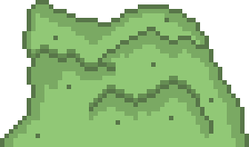

# **The Zazacrifice of Shaggy**
    Game by: 
    Franciso Martinez A01782250
    Santiago Tena A01781283
    Sergio Zuckermann A01024831
    Domingo Mora A01783317
    Ian Holender A01026295
    Rafa Blanga A01781442

## _Game Design Document_

---

##### **Copyright notice / author information / boring legal stuff nobody likes**

##
## _Index_

---

1. [Index](#index)
2. [Game Design](#game-design)
    1. [Summary](#summary)
    2. [Gameplay](#gameplay)
    3. [Mindset](#mindset)
3. [Technical](#technical)
    1. [Screens](#screens)
    2. [Controls](#controls)
    3. [Mechanics](#mechanics)
4. [Level Design](#level-design)
    1. [Themes](#themes)
    2. [Game Flow](#game-flow)
5. [Development](#development)
    1. [Abstract Classes](#abstract-classes--components)
    2. [Derived Classes](#derived-classes--component-compositions)
6. [Graphics](#graphics)
    1. [Style Attributes](#style-attributes)
    2. [Graphics Needed](#graphics-needed)
7. [Sounds/Music](#soundsmusic)
    1. [Style Attributes](#style-attributes-1)
    2. [Sounds Needed](#sounds-needed)
    3. [Music Needed](#music-needed)
8. [Schedule](#schedule)

## _Game Design_

---

### **Summary**

Dive into an exciting adventure with The Zazacrifice of Shaggy, a turn-based RPG follows the protagonist, Shaggy, as he battles his way through. Encounter fierce enemies, navigate tricky puzzles and uncover hidden secrets as you journey through this challenging and immersive RPG. 

### **Gameplay**

Shaggy, as he attempts to rescue his furry companion, Scooby, who was abducted by a mysterious gang. A homeless man who witnessed the abduction gives Shaggy information about the gang’s whereabouts in exchange for the recovery of some heavily sedating potions that the gang stole from him.

Arm yourself with a selection of weapons to prepare yourself for the battles ahead. The homeless man offers Shaggy three types of weapons; these will determine the set of attacks and statistics available throughout the game. Shaggy must be prepared for the enemies he will encounter on his journey.  There will be semi-bosses protecting an elemental chest and a NPC storyteller, after deafiting the Semi-boss Shaggy will unlock a new element and the NPC Storyteller will tell Shaggy a fragment of scooby´s mistery. He also begins with a selection of items with basic uses, including Rage, Health Boost, Endurance Boost, and Special Powers. As he progresses, he may find other potions, spells and abilities to help him along the way.

The gameplay of The Zazacrifice of Shaggy is designed to be an adventurous game with PvP battles against NPCs and level bosses. Search for hidden secrets as you battle your way through intense boss battles and difficult dungeons. Unlock new abilities, customize your character with a variety of weapons,armor  and elements to unlock the door to the tower and make your way to the top of the tower and uncover the truth behind the Zazacrifice. An unforgettable journey awaits in The Zazacrifice of Shaggy

### **Mindset**

The ideal mindset we strive for in this game is the following: We want the user to feel a sense of wonder at the start of the game as he is being told the story of the game. When the user has chosen his battle abilities and has a bit more of context as well as power, we want the player to feel powerful and excited for this new adventure. To provoke the player even more we plan on adding NPC’s whose purpose is to slow the player down (MOB´s), so the salvation of his furry companion doesn't come that easy. This will provoke the player to prepare and strategically play his way into the castle. A feeling of urge and hurry for saving scooby will also be provoked, by the dialogs of the NPCs and shaggy's flashbacks.

## _Technical_

---
### **Screens**

1. Title Screen
    1. Menu
    2. options 
2. Game
    1. Inventory
    2. Map
    3. Gandalf´s store 
    4. Playable
3. End Credits

### **Controls**

we will have 2 different gaming options:

Option A (gamer type):
controls:
1. "W" = forward
2. "D" = right.
3. "S" = backwards
4. "A" = Left.
5. "Q" = Interact (open doors, confirm purchases, drink potions)
6. "I" = Inventory/Bag
7. "ESC" = Menu.

Option B (Modern type):
controls:
1. "Up arrow" = forward
2. "Right arrow" = right.
3. "Down arrow" = backwards
4. "Left Arrow" = Left.
5. "Q" = Interact (open doors, confirm purchases, drink potions)
6. "I" = Inventory/Bag
7. "ESC" = Menu.

### **Mechanics**
_Combat System_:

 The main mechanic of the game will be the combat system, this system will be based on the following stats:
 
    1. -HP (Life Points)
    2. -MP (Magic points to use special attacks)
    3. -STR (How strong the attacks will be)
    4. -DEF (How much will resist enemy attacks)
    5. -LUC (Increases probability of making a critical attack)
    6. -AGL (Decreases probability of getting a critical attack)
    7. -CHR (It will allow you to get discounts in the store and better rewards but enemies have a chance of calling a new mob)

The combat will have the following rules and characteristics:
- The goal of the combat is to defeat every enemy by getting their stat all the way to zero.

- On a combat you´ll be able to fight between 1 and 5 enemies. 
.
- The combat will be in turned base until the main character or the enemies no longer has HP.

- During combat the player can choose to use normal attacks, magic attacks (consumes MP, but are stronger and have special abilities), use a consumable(Item that will afect stats), change element or run away from the battle.

- The equipped weapon will affect the characters stats.

- There is a chance to receive or deal a critical attack that does 200% damage.The luck stat will increase you´re chances of dealing this kind of attacks (remember if enemies have a very high Luck Stat they can deal the critical attack).

- The character will have one of three classes (light, medium, heavy), that will affect their statistics.

- Character will have an element when the combat starts. This elements are the following:
    1. Fire 
    2. Electric 
    3. Ground 
    4. Water 
    5. Wind

- Elements will have advantage against another element as the following:
    1. Fire > Wind 
    2. Water > Fire
    3. Electric > Water 
    4. Ground > Electric
    5. Wind> Ground

- If the an character attacks a character where it's element has an advantage over the other the attack will deal 2x, and if the element has a disadvantage it will deal 0.5x.

- So the damage an attack does will be calculated, taking into consideration the following: 
    - The attack stat from the attacker.
    - The defense stat from the receiver.
    - The attack power.
    - If the attack is critical.
    - If the characters have element weaknesses or strenghs.

- The first attack will be decided by who attacks first the other on the map.

- If the match is won the player is rewarded with money.

- The enemies stats will be determined by the total sum of shaggy's stats. The total sum will be multipled by a number which is unique to each enemy and then will be distributed equally between the enemy's stats. for example: The weakest enemies will have a very low multiplier aproximately of .30, so 30% of Shaggy total sum of stats will be distributed in the foes stats. Next the 25% of Shaggy's total sum will be given to a random stat of the enemy for example: An enemy will get a boost in atack or resistance. This is to make the combat dynamic and non glued to EXP conventions, the boost will be shown in a text For example "Wow, this wizard has a lot of strenght +25 STR".

- Bosses and Semi-Bosses will have fixed stats, this to make them hard battles for the player.

_Movements, Exploration and Objectives_:

The game will be a topdown RPG, where the player will be able to 
explore to move freely on the designated zone of the map. The movements and exploration mechanics will have the following rules and characteristics:

- The player will be able to interact with objects, characters and enemies.

- Some objects such as coins will grant the player benefits when picking them up.

- Zones in the map will be closed for the player until the necessary tasks to advance are completed.

- The player will also get consumables to regenerate HP and MP or key items by completing battles or side-quests.

- If enemies notice main character they´ll run forward after him, in case of colappsing (with main character) the battle will begin with enemies having the first attack.

- If main character hits enemy, the battle will begin with main character having the first attack

- Text Dialogs and story events will be displayed, if certain conditions are satisfied.

- In the overworld the player can see their current health and magic points in the down left corner.

- The main objective is to save Scooby by defeating all the semi-bosses in order to acquire the different elements to be able to defeat the final boss.

_Other_ :

- The pause screen will show resume, quit and backpack. The backpack is the main hub of the game, a menu, showing the screen in four quarters the first one  (upper left) will show three option which will be shown in the second quarter (upper right). SThe options are ITEM, GEAR and MOVES, the player's possesions in will be shown in the second quarter depending on which category they are. The third quarter will show shaggy's current stats (down left). The fourth one (down right) will show the current selection in the second quarter with an image and description of the selection. 

- Gandalf stores will be distributed on the map, each store will have unique items that the player can buy.

_Possible results of the game_:

- The player saves Scooby by defeating the final boss. 

- The player respawns in the last saved checkpoint.

- The player finds the golden Zaza.

## _Level Design_

### **Themes**
1. House
    1. Mood
        1. Cozy, Warm, Safe 
    2. Objects
        1. _Ambient_
            1. Window
            2. Wall
            3. House Couch
            4. House Bed
            5. House Table
            6. House Cupboard
            7. House Mail box
            8. Old furniture
        2. 
            _Interactive_
            1. Villager NPC
            2. Door
            3. NPC Seth Rogan
        
2. Village
    1. Mood
        1. Calm, Friendly, Cozy, Safe
    2. Objects
        1. _Ambient_
            1. Houses
            2. Paths
            3. House Mail box
            4. wooden fences
            
        2. _Interactive_
            1. Villager NPC
            2. Doors
            3. NPC Hobbit
3. Gandalf Store
    1. Mood 
        1. Commercial, Safe, Calm
    2. Objects
        1. _Ambient_
            1. House Table
        2. Interactable
            1. Gandalf NPC
            2. Weapons (Classes )
                1. Satff
                2. Dagger
                3. Sword
                4. Long Sword
                7. Wooden club
                8. Mace
                9. Waraxe
                10. Rapier
                11. Machete
                12. Katana
            3. Others
                1. Lucky items 
                    1. Elden ring 
                    2. Rabit foot 
                    3. Garlic
                2. Charimsa items 
                    1. Silly jokes book
                    2. GetdaRizz
                    3. Apples&Bananas
                3. Agility Items
                    1. Speed Shoes
                    2. Lord Jesus Sandals 
                    3. Speedy Gonzales Speed.
                4.  Potion 
                    1. HealPotion 
                    2. DefensePotion 
                    3. AttackPotion 

4. Forest
    1. Mood
        1. Green, Mysterious, adventurous
  2. Objects
        1. _Ambient_
            1. Bush
            2. Tree
            11. Tree trunk
            12. Rock
            13. Gate
            14. Grass

        2. _Interactive_
            1. Chests
            2. Berries
            3. Apples
            4. Enemy Zabush
            5. Enemy Wizzard
            7. EnemyZaclon
            8. Golden Coins
            9. EnemyGiantZanaZana

5. Castle
    1. Mood
        1. Dangerous, tense, Creepy and Ominous
    2. Objects
        1. _Ambient_
            1. ObstacleCastleRock
            16. ObstacleCastlePillar
            17. Torches
            18. Suits of armor
            19. Locked doors
            20. Catle Ground
    
    2. _Interactive_
        1. Chest
        2. Golden Coins
        3. Doors
        4. EnemyZaguards
        5. EnemyZaclon
        6. EnemyLordZAggy

### **Game Flow**
1. Player starts in Village.

2. NPC calls shaggy and gives him his first task (Here the user selects class and first element).

3. Game tells you to go to the forest.

4. Shaggy leaves village. 

5. Shaggy enters the forest.

6. Shaggy explores forest, having encounters with NPC's as well as having chances of collecting consumables to help the user later on.

7. Shaggy experiences an event where he experiences a flashback of that night. Also he is tasked to go find elements.

8. Shaggy finds semi-bosses protecting the forest; elemental chest are earned in victory, recieving new elements as well as a fragment of what happened with scooby.

9. The Storyteller NPC with each semi-boss will give the user more context of what happended with scooby as of who he will encounter further on so 'Shaggy' can plan accordingly (Sneak-peak of bosses).

10. Once "Shaggy" has collected all elements he experiences an event were he will now know where to go next (Exit the Forest).

11. Shaggy must find the castle location, which can be found beyond the forest.

12. Shaggy finds a Story-telling NPC in the outskirts of the castle where he must use & try-out new elements by completing mundane tasks such as put out fire.

13. Shaggy will then be able to go to the castle and find the castle's main room.

14. Once shaggy enters the castle's main room he will enconter & fight a low-ranking enemies protecting a Red-Room.

15. Shaggy will then be able to go to the Red-Room, & fight the final boss.

16. Shaggy encounters with Scooby, final story event is displayed and after that credits are displayed 

## _Development_

---

### **Abstract Classes / Components**

1. BasePhysics
    1. BasePlayer
    2. BaseEnemy
    3. BaseNPC
    4. BaseObject
        1. Consumible 
        2. Weapons
        3. Other
2. BaseObstacle
3. BaseInteractable

### **Derived Classes / Component Compositions**

#### *Program scripts required 

1. BasePlayer *(PlayerMovement, PlayerAttacks, PlayerInteractions, PlayerClass, PlayerObjectConsumable, PlayerUptdateStats)
    1. PlayerMain
        1. Light player 
        2. Middle player 
        3. Heavy player 

2. BaseEnemy *(EnemyMovement, EnemyAttack, EnemyInteractions, EnemyClass)
    1. EnemyZabush (Chance to drop Berries, Forest)
    2. EnemyWizzards (Chance to drop zazza, Forest)
    3. EnemyZaclon (Chance to drop Berries,Castle)
    4. EnemyZaguard (Chance to drop zazza,Castle)
    5. EnemyGiantZanaZana (semi-boss, Forest)
    6. EnemyLordZA (final boss, Castle)

4. BaseNPC *(NpcMovement, NpcInteractions)
    1. NPCVillager (both average NPC women/men)
    2. NPCGandalf (Item store)
    3. NPCSethRogan (First NPC that interacts with Shaggy)
    4. Storyteller NPC 

3. BaseObject *(PLayerObjectInteraction, ObjectEffects)

    1. Consumible
        1. Berries (heals 5% of health)
        2. Apple (heals 25% of health)
        3. Fish (heals 50% of health)
        4. Meat (heals 75% of health)
        5. Basic zaza (heals small ammount of MP)
        6. Middle zaza (Heals normal ammount of MP )
        7. Heavy zaza (Heals a really good ammount of MP)

    2. Weapons (Classes )
        1. Satff
        2. Dagger
        3. Sword
        4. Long Sword
        7. Wooden club
        8. Mace
        9. Waraxe
        10. Rapier
        11. Machete
        12. Katana

    3. Others
        1. Lucky items 
            1. Elden ring 
            2. Rabit foot 
            3. Garlic
        2. Charimsa items 
            1. Silly jokes book
            2. GetdaRizz
            3. Apples&Bananas
        3. Agility Items
            1. Speed Shoes
            2. Lord Jesus Sandals 
            3. Speedy Gonzales Speed.
        4.  Potion 
            1. HealPotion 
            2. DefensePotion 
            3. AttackPotion 

4. BaseObstacle 
    1. Window
    2. Wall
    3. House Couch
    4. House Bed
    5. House Table
    6. House Cupboard
    7. House Mail box
    8. Old furniture
    9. Bush
    10. Tree
    11. Tree trunk
    12. Rock
    13. Gate
    14. Grass
    15. ObstacleCastleRock
    16. ObstacleCastlePillar
    17. Torches
    18. Suits of armor
    19. Locked doors
    20. Catle Ground
    21. Houses
    22. Paths
    23. House Mail box
    24. wooden fences

5. BaseInteractable *(PlayerItemInteraction)
    1. InteractableButton

*(SceneLoading)   
   

_(example)_

## _Graphics_

### **Style Attributes**

Every area will have a different palette to show the difference between the feelings that the area is trying to convey. At the tower the colors will be dark purples, grays and blacks while the forest will be bathed in natural greens, lush blues and a more colorful feeling. Right now there is not a plan to make a limited palette because the world might suffer from those limitations especially in the short amount of development time. So because of time constraints and for not choosing a limited palette a HSV map is out of the question, if an element feels out of order the colors will be altered to maintain consistency without HSV maps. Anyways, because consistency is key for immersion, the aim will be to make every element part of the world with their colors even though we're not using a color palette, but more of a color vibe.

The graphic style of the game is going to be based on 16 bit-s JRPG’s so the look will be pixely with a medieval twist because of the RPG genre making for a very interesting combination of D&D, Scooby Doo and 16 bit-games. Everything is going to be pixely, outlining important characters and elements of the game with a wider border. We will be emphasizing on the sharp squared feel of the 16 bit genre, which pulled off the sharper edges over circular graphics flawlessly. The most important elements will be enemies, NPCs, Shaggy, enemies and interactables. Also, the assets will be recovered from limited free sources so that the style doesn’t vary a lot. The supervisor of the visual style of the game will have the job to approve every single element of the game so that it can achieve a cohesive style.

Every single intractable object in the game will have a prompt so that the player notices the item or NPCs and interacts with it. Every character receiving damage (Shaggy or enemies) will be turned to a red silhouette for one frame so that the player receives the feedback of damage being done or received. Every single time the player defeats an enemy or buys something the visual cues will lead the player to excitement because of the sharp graphics that will congratulate the player on its merits. When delivering a critical hit the enemy will be red for more frames and also will announce a critical hit with bolder text. The light attacks will feel faster and the heavier attacks will feel slower but will convey that heavy feeling. Every element will have its own distinct color so that the player has no problem recognizing between them. Finally the backpack will show the player what are the advantages and disadvantages of each item, gear or attack by visualizing arrows pointing upwards or downwards depending on the positive or negative state that affects that stat.

### **Graphics Needed**

(Animations)= (Idle, Walk, Attack, Consuming)

1. GraphicsPlayer
    1. PlayerMain (Animations)

2. GraphicsEnemy
    1. EnemyZabush (Animations)
    2. EnemyWizzards (Animations)
    3. EnemyZaclon (Animations)
    4. EnemyZaguard (Animations)
    5. EnemyGiantZanaZana (Animations)
    6. EnemyLordZA (Animations)

4. GraphicsNPC
    1. NPCVillager (Idle, Walking)
    2. NPCGandalf (Idle, Walking)
    3. NPCSethRogan (Idle, Walking)
    4. Storyteller NPC (Idle, Walking)

3. GraphicsObject

    1. GraphicsConsumible
        1. Berries (icon)
        2. Apple (icon)
        3. Fish (icon)
        4. Meat (icon)
        5. Basic zaza (icon)
        6. Middle zaza (icon)
        7. Heavy zaza (icon)

    2. GraphicsWeapons
        1. Satff (Item Grpahic, Attack animation)
        2. Dagger (Item Grpahic, Attack animation)
        3. Sword (Item Grpahic, Attack animation)
        4. Long Sword  (Item Grpahic, Attack animation)
        7. Wooden club (Item Grpahic, Attack animation)
        8. Mace (Item Grpahic, Attack animation)
        9. Waraxe (Item Grpahic, Attack animation)
        10. Rapier (Item Grpahic, Attack animation)
        11. Machete (Item Grpahic, Attack animation)
        12. Katana (Item Grpahic, Attack animation)

    3. GRaphicsOthers
        1. Lucky items 
            1. Elden ring (icon)
            2. Rabit foot (icon)
            3. Garlic (icon)
        2. Charimsa items 
            1. Silly jokes book (icon)
            2. GetdaRizz (icon)
            3. Apples&Bananas (icon)
        3. Agility Items
            1. Speed Shoes (icon)
            2. Lord Jesus Sandals  (icon)
            3. Speedy Gonzales Speed. (icon)
        4.  Potion 
            1. HealPotion (icon)
            2. DefensePotion (icon)
            3. AttackPotion (icon)

4. VisualsObstacle 
    1. Window
    2. Wall
    3. House Couch
    4. House Bed
    5. House Table
    6. House Cupboard
    7. House Mail box
    8. Old furniture
    9. Bush
    10. Tree
    11. Tree trunk
    12. Rock
    13. Gate
    14. Grass
    15. ObstacleCastleRock
    16. ObstacleCastlePillar
    17. Torches
    18. Suits of armor
    19. Locked doors
    20. Catle Ground
    21. Houses
    22. Paths
    23. House Mail box
    24. wooden fences

_Examples:_

### Main Menu:

### Main Character and NPC:

### Zabush Sprite:

### World Assets:

### Example of in Game Gameplay:

### Dungeon Assets:

### Sprite Sheet:

## _Sounds/Music_

---

### **Style Attributes**

We are aiming to have a cohesive game expierence across the game, and of course the music and sound efects are no exception. We want the music to inspire mystery and a sense of adventure to get the player into the same type of mood we were in while creating this game. 

Across the game the player will be experiencing music heavily carried by synthesizers in order to get this mystical feeling we have been talking about. The songs will be changing depending on what the player is doing, for example there will be one specific song as our main theme that the player will be able to hear while in the menu called _Gandalf pack_ by the artist _xac_. On the other hand, playable sceneries will have different soundtracks like the fores, Gandalf&#39;s store, the tower, and everytime you fight an enemy. 

Regarding the sound effects, these will be reactive to the player&#39;s actions, like the sound of the steps depending on the surface, or wether the player is opening a chest or a door. All of these sound effects will be in a 8 or a 16 bit style.

### **Sounds Needed**

1. Effects
    1. Soft Footsteps (dirt floor)
    2. Sharper Footsteps (stone floor)
    3. Chest Opening
    4. Door Opening
    5. Mob sound
    6. NPC gibberish
    7. Hit sound (in battle)
    8. Relieved &quot;Ahhhh!&quot; (health)
    9. Shocked &quot;Ooomph!&quot; (attacked)
    10. Sad chime (died)
    11. "pip" (picking a coin)

### **Music Needed**

1. Slow-paced, nerve-racking &quot;forest&quot; track
2. Synthwave, reverbed, slow-paced track
3. Creepy, slow &quot;dungeon&quot; track
4. Sad ending credits track
5. Fast-paced, accelerated-paced, mob, semiboss and final boss track

_(example: https://youtu.be/ZxRHXC2SB4E Gandalf Pack by Xac)_

## _Schedule_

---

1. Develop base classes and combat system (March 17- March 25)
    1. base player
    2. base enemy
    3. base stats
    4. base elements
    5. base items
    6. base attacks
    7. base classes

2. Recover all visuals/sounds used in the game (March 17- March 25)
	1. All Shaggy’s sprites
	2. All NPCs sprites
	3. All enemies and boss sprites
	4. All menu/narrative/base game sprites
	5. All Obstacle sprites
	6. All item and gear sprites
	7. All the game soundtrack
	8. All the game sound effects
	9. The different scenes world maps

3. Implement obstacles, game map, character and intractable properties  (March 26- April 5)
	1. Implement controls
	2. Implement sprites
	3. Implement game sounds
	4. Implement collision properties for obstacles
	5. Implement intractable properties for interactables
	6. Implement menu
	7. Implement backpack

4. Implement combat (April 5- April 8)
	1. Testing combat and difficulty feel
	2. Balancing the game

5. Bug fixes and polishing (April 8- April 12)
